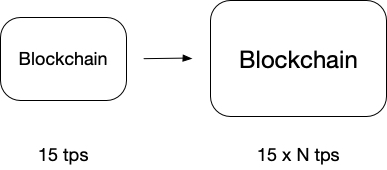
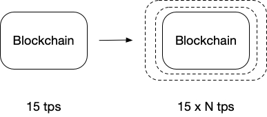

## 深入理解Plazma（一）Plasma 框架

Plasma 作为以太坊的二层扩容框架，自从 2017 年被 Joseph Poon（Lightning Network 创始人）和 Vitalik Buterin （Ethereum 创始人）提出以来[[1]](http://plasma.io/plasma.pdf)，一直是区块链从业人员关注的焦点[[2]](https://ethresear.ch/c/plasma)。首先需要明确的是，Plasma 实质上是一套框架，而不是一个单独的项目，它为各种不同的项目实际项目提供链下（off-chain）解决方案。这也是为什么很多人对 Plasma 感到疑惑的一个重要原因，因为在缺乏实际应用场景的情况下很难将 Plasma 解释清楚。
因此，理解 Plasma 是一套框架是理解 Plasma 的关键。

### 从区块链扩容谈起

在介绍 Plasma 之前，不得不先介绍区块链扩容。我们都知道，比特币（Bitcoin）和以太坊（Ethereum）作为目前最广泛使用的区块链平台，面临的最大问题就是可扩展性（Scalability）。这里需要注意的是，区块链中的可扩展性问题并不是单独特指某个问题，而是区块链想要实现 Web3.0[[3]](https://medium.com/l4-media/making-sense-of-web-3-c1a9e74dcae) 的愿景，为亿万用户提供去中心化服务所要克服的一系列挑战。虽然以太坊号称是“世界计算机”，但这台“计算机”却是单线程的，每秒钟只能处理大约 15 条交易，与目前主流的 Visa 和 MasterCard 动辄每秒上万的吞吐量相比实在相形见绌。因此如何在保证区块链安全性的情况下，提高可扩展性是目前区块链发展亟待解决的问题之一。

目前关于区块链扩容的解决方案无外乎两个方向：一层（ayer 1）扩容和二层（Layer 2）扩容[[4]](https://blog.ethereum.org/2018/01/02/ethereum-scalability-research-development-subsidy-programs/)。一层扩容也被称为链上（on-chain）扩容，顾名思义，这类扩容方案需要更改区块链底层协议。但同时也意味着需要将区块链硬分叉。这类扩容方案就像将原来的单核 CPU 改装成多核 CPU，从而可以多线程处理计算任务，提高整个网络的吞吐量。

目前最典型的一层扩容方案是 Vitalik 和他的研究团队提出的“Sharding（分片）”，也就是说将区块链划分成不同的部分（shards），每个部分独立处理交易。想要了解更多关于 Sharding 的信息，可以参考以太坊官方的 Wiki[[5]](https://github.com/ethereum/wiki/wiki/Sharding-FAQs)。

二层扩容也称链下（off-chain）扩容，同样非常好理解，这种扩容方案不需要修改区块链底层协议，而是通过将大量、频繁的计算工作转移到“链下”完成，并定期或在需要时将链下的计算结果提交到“链上”保证其最终性（finality）。二层扩容的核心思想是将底层区块链作为共识基础，使用智能合约或者其它手段作为链下和链上沟通的桥梁，当有欺诈行为发生时链下的用户仍然可以回到链上的某一状态。虽然将计算转移到链下会在一段时间内损失最终性，但这个代价是值得的，因为这样做不止可以极大提高区块链的灵活性和可扩展性，也极大降低了用户进行交易所需要的代价。将计算转移到链下也并不意味着完全放弃安全性，因为最终的安全性还是由底层所依赖的区块链来保证，因此二层扩容主要关注的问题就在于如何保证链上链下切换过程的安全性。这种思想最早被用在闪电网络（Lightning Network）当中作为比特币的其中一个扩容方案，并取得了很好的效果。

本文所要介绍的 Plasma 就属于基于以太坊二层扩容方案，类似的解决方案还有 [State Channels](https://medium.com/l4-media/generalized-state-channels-on-ethereum-de0357f5fb44) 和 [Trubit](https://truebit.io/)。这些方案虽然面向的问题有所区别，但基本思想都是将复杂的计算转移到链下进行。那么，接下来我们将进入 Plasma 的世界，一窥究竟！

### 什么是 Plasma

### Plasma 工作流程

### 安全性讨论

### Plasma 研究现状

### 相关资源

1. [https://plasma.io/](https://plasma.io/)
2. [https://ethresear.ch/c/plasma](https://ethresear.ch/c/plasma)
3. [https://medium.com/l4-media/making-sense-of-web-3-c1a9e74dcae](https://medium.com/l4-media/making-sense-of-web-3-c1a9e74dcae)
4. [https://blog.ethereum.org/2018/01/02/ethereum-scalability-research-development-subsidy-programs/](https://blog.ethereum.org/2018/01/02/ethereum-scalability-research-development-subsidy-programs/)
5. [https://github.com/ethereum/wiki/wiki/Sharding-FAQs](https://github.com/ethereum/wiki/wiki/Sharding-FAQs)
6. [https://medium.com/l4-media/making-sense-of-ethereums-layer-2-scaling-solutions-state-channels-plasma-and-truebit-22cb40dcc2f4](https://medium.com/l4-media/making-sense-of-ethereums-layer-2-scaling-solutions-state-channels-plasma-and-truebit-22cb40dcc2f4)
6. [https://medium.com/@argongroup/ethereum-plasma-explained-608720d3c60e](https://medium.com/@argongroup/ethereum-plasma-explained-608720d3c60e)
