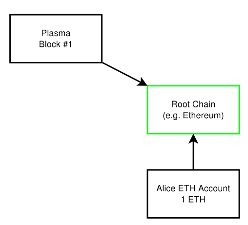
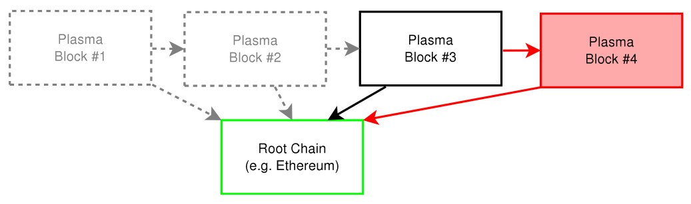

## 深入理解Plasma（二）Plasma 细节剖析

> 这一系列文章将围绕以太坊的二层扩容框架，介绍其基本运行原理，具体操作细节，安全性讨论以及未来研究方向等。本篇文章主要对 Plasma 一些关键操作的细节进行剖析。

在[上一篇](https://github.com/gitferry/mastering-ethereum/blob/master/Plasma-in-depth/plasma-framework.md)文章中我们已经理解了什么是 Plasma 框架以及它是如何运行的，这一篇文章将对其运行过程中的一些关键部分，包括 Plasma 提交区块的过程，当有恶意行为发生时如何构建防伪证明以及如何退出 Plasma 子链等进行剖析。需要注意的是，由于 Plasma 是一套框架，因此本文只剖析 Plasma 项目的共性，每一部分的实现细则还是需要参考实际的项目，例如 Plasma MVP（Minimal-Viable-Plasma）和 Plasma Cash 等。

### 存款（Deposit）
Plasma 的主要思想就是将大部分计算过程都转移到链下进行，用户只有在进入和退出 Plasma Chain 的时候需要跟主链上的智能合约交互，这也是所有 Plasma 应用的标准流程。

用户在将主链的资产（如以太币或者其它 ERC20 合约发布的 token）转移到 Plasma Chain 的过程称为存款（Deposit），具体做法是直接向主链上的 Plasma 合约发送以太币或 token。Plasma 合约收到 Deposit 交易后会在子链上创建跟 Deposit 数额一致的交易，并将其打包进区块中，作为存款确认的证明。这个过程如下图所示（来源自[[1]](https://plasma.io/)）。

当用户看到子链上自己之前存款的交易被确认后，就可以在子链上使用这笔资产（给子链上的其他用户发送交易或者退出子链等）。

### 状态确认（State Commitment）

当大部分都转移到链下进行时，需要某种机制确保链下状态的更新得到确认，这样才能保证当有恶意行为发生时，主链可以保证用户不会受到损失。这就是为什么需要状态确认（State Commitment），即子链周期性地将状态更新情况提交到主链进行共识。

然而，将子链中的所有交易都同步到主链显然违反了 Plasma 的初衷，在 Plasma 中，实际向主链提交的是 Merkle Tree 的根哈希。因此子链中的实际交易情况被隐藏，在主链上只能看到子链区块的哈希值。

当有恶意行为发生时，子链网络中的所有用户都可以向主链提交防伪证明，证明成立后，含有恶意交易的区块将被回滚。

### 防伪证明（Fraud Proof）

Plasma 的一个关键设计之一就是允许用户构造防伪证明（Fraud Proof）。防伪证明的意义在于只要发布区块的节点构造了含有恶意交易的区块，那么就要承担被惩罚的风险。每当新的区块被提交到主链上时，会留出一段时间给用户提交防伪证明，如果在这段时间内没有证明被提交，则认为新的区块被验证合法。如果有防伪证明检测到区块中存在恶意交易，则该区块将被舍弃，回滚到上一个被验证合法的区块。Plasma 中的防伪证明主要有以下（但不限于）几种：

* 资产可花费证明
* 交易签名有效性证明
* 存取款证明

至于每种防伪证明的具体形式，则依赖于实际 Plasma 应用的实现细则。

如下图所示（来源自[[1]](https://plasma.io/)），子链中每个节点都存有 1-4 个区块的数据。假设区块 1-3 已经被验证合法，而区块 4 中存在恶意交易，那么每个节点都可以使用 1-4 个区块中的数据构造防伪证明提交到主链，主链验证后将子链中的状态回滚到区块 1-3。

防伪证明还可以使用零知识证明（zk-SNARKs 或者 STARKs）来构造，但由于目前通过零知识证明生成证明的时间和空间还有待优化，目前设计的 Plasma 并不依赖零知识证明。零知识证明在 Plasma 中的应用是一个很有前景的研究方向，感兴趣的读者可以参考以太坊研究团队关于这方面的研究[[2]]([[1]](https://plasma.io/))。

### 取款（Withdraw）

### 总结

## 相关资源

1. [https://plasma.io/](https://plasma.io/)
2. [https://ethresear.ch/t/plasma-is-plasma/2195](https://ethresear.ch/t/plasma-is-plasma/2195)
