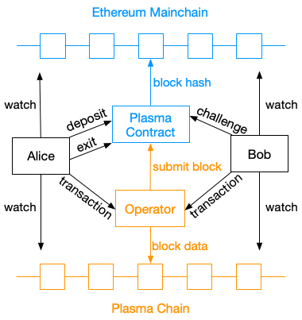

## 深入理解Plasma（三）Plasma MVP

> 这一系列文章将围绕以太坊的二层扩容框架，介绍其基本运行原理，具体操作细节，安全性讨论以及未来研究方向等。本篇文章主要介绍 Plasma 的一个最小实现 Plasma MVP（Minima Viable Plasma）。

在[上一篇](https://github.com/gitferry/mastering-ethereum/blob/master/Plasma-in-depth/plasma-in-detail.md)文章中我们已经理解了 Plasma 中的一些关键操作，但是 Plasma 是一套框架，如果脱离了实际的应用，仍然很难彻底理解它。因此本篇将详细介绍 Plama 的第一个项目 Plasma MVP（Minimal Viable Plasma），即在 Plasma 框架下的最基础的实现。Plasma MVP 是 Vitalic 和他的团队在 2018 年初提出的基于 UTXO 模型实现的 Plasma 设计标准[[1]](https://ethresear.ch/t/minimal-viable-plasma/426)，它以最简单的方式实现了链下交易，但无法支持复杂的计算，例如脚本（Script）和智能合约。在阅读下面的内容之前，请确保已经理解了这个系列之前的文章。

整个 Plasma MVP 的生命周期可以通过下面这幅图表现出来：

### Plasma 合约
首先需要将 Plasma 合约部署到主链（以太坊）上作为主链和子链沟通的媒介。Plasma 合约会处理由子链提交的区块，并且将区块的哈希值存在主链上。除此之外，还会处理用户的存款（deposit）、取款（withdrawal/exit）以及争议（challenge）操作。

Plasma 合约中主要包括的数据结构有：

* Owner：合约的拥有者（即部署合约交易的发送者）的地址，即部署合约交易的发送者；
* Plasma 区块列表：每个 Plasma 区块中存储了（1）区块的 Merkle root（2）区块提交的时间；
* 退出列表：即提交了退出申请的列表，每个退出申请存储了（1）申请者的地址（2）申请退出的 UTXO 的位置。

Plasma 合约中主要包括的函数有：

* submitBlock(bytes32 root)：向主链提交一个区块，仅仅提交区块中所有交易的 Merkle root；
* deposit()：生成一个只包含一个交易的区块，这个交易中包含与 msg.value 值相等的 UTXO；
* startExit()：执行给定 UTXO 的退出操作；
* challengeExit()：向某个正在执行的退出提出争议。

### Operator
在前面的文章中我们已经知道 Plasma 子链是一个独立的区块链，那么也就有独立的共识机制。在 Plasma MVP 中采用的共识机制就是 PoA（Proof of Authority），即参与共识的只有唯一一个矿工，称为 Operator。Operator 负责处理所有子链上发生的交易，将其打包成区块存储在子链上，并且周期性地向 Plasma 合约提交区块，将子链上的状态（区块的哈希值）提交到主链共识。那么，既然 Operator 是唯一的矿工，这不就意味着 Plasma 违背了去中心化的初衷了吗？其实，这是去中心化向执行效率的妥协。在之前的文章中也提到过，Plasma 的安全基础依赖于底层的区块链，只要底层的区块链能够保证安全，那么在 Plasma 子链上发生的最差结果也只是迫使用户退出子链，而不会造成资产损失。

### 存款（deposit）
用户 Alice 通过存款（deposit）操作向 Plasma 合约发送带有一定数额的以太币或 ERC20 token 加入 Plasma Chain，这时 Plasma 合约会执行 deposit() 函数，生成一个只包含一个交易的区块，这个交易的 UTXO 记录了 Alice 从主链转移到子链的数额。当这个区块被主链确认后，Alice 就可以使用新生成的 UTXO 向其它用户发送交易了。

### 交易（transaction）
在 Plasma MVP 中，所有用户发送的交易都是直接发送给 Operator，当积累了一定数量的交易后，由 Operator 将交易打包成区块。这里需要注意的是，由于 Plasma MVP 采用的是 UTXO 模型，所以即使交易的收款方不存在，交易也是成立的。

### 生成区块

在 Plasma MVP 中，一个 Plasma 区块产生的情况只有两种：一种是 Operator 打包生成区块，另外一种是当用户执行 deposit 操作时，由 Plasma 合约直接生成一个只包含一个交易的区块。

### 确认签名（Confirmation Signatures）
TODO

### 监视子链
TODO

### 取款（withdrawal/exit）
当 Alice 想要退出子链时，需要向 Plasma 合约发送一个 exit 交易，申请中需要包含（1）所要退出的 UTXO 的位置，包括区块号（blknum）、区块内交易号（txindex）以及交易内输出号（outindex）（2）包含该 UTXO 的交易（3）该交易的 Merkle proof（4）用于生成该 UTXO 所涉及的之前一系列交易的确认签名。之后这个申请会被放入一个优先队列中，通过这个公式计算优先级：

>Priority = blknum * 1000000000 + txindex * 10000 + oindex

合约通过调用 startExit() 函数执行对给定 UTXO 的退出操作。

### 争议（Challenge）
在 Alice 的某个 UTXO 退出子链的过程中，如果 Bob 发现有恶意行为发生，他可以提出一个争议（challenge）。一个争议需要给出针对的 UTXO 的位置，以及该 UTXO 被花费的证明，即该 UTXO 已经存在于某个交易中，且这个交易已经被打包到区块。

合约通过调用 challengeExit() 函数执行一个争议，争议成功后会取消正在执行的取款操作。

### 相关项目

> Talk is cheap, show me your code.

目前已经有许多机构和公司已经实现了 Plasma MVP，但实现的语言和细节有所不同：

* FourthState Lab[[2]](https://github.com/fourthstate)
* Omisego[[3]](https://github.com/omisego/plasma-mvp)
* Kyokan[[4]](https://github.com/kyokan/plasma)

### 总结

本文介绍了 Plasma 的最小实现版本 Plasma MVP，虽然采用最简单的 UTXO 模型，但已经足够体现出 Plasma 的核心思想。接下来的文章将会介绍另外一个稍微复杂一点的项目，Plasma Cash。

### 相关资源

1. [https://ethresear.ch/t/minimal-viable-plasma/426](https://ethresear.ch/t/minimal-viable-plasma/426)
2. [https://github.com/fourthstate](https://github.com/fourthstate)
3. [https://github.com/omisego/plasma-mvp](https://github.com/omisego/plasma-mvp)
4. [https://github.com/kyokan/plasma](https://github.com/kyokan/plasma)
