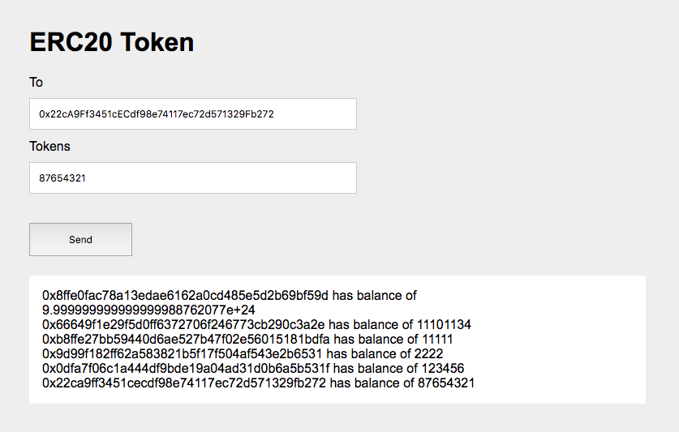

捕捉智能合约中的event实战
=======================

## 写在前面
在上一篇文章 [Web与智能合约交互实战](https://github.com/gitferry/mastering-ethereum/blob/master/web3-interact-with-Solidity/web3-interact-with-Solidity.md)
中我们已经掌握如何使用 ``Web3`` 控制智能合约，并且实现了一个简单的Dapp，可以通过浏览器简单地实现数据的设置和读取。

在本文中，我们将介绍智能合约中的 ``event``，以及如何捕捉智能合约的 ``event``。

在实战环节中，我们将使用 Javascript API 捕捉一个 ERC20 合约中的 Transfer() 事件，并在网页中显示出合约中每个账户的余额。

## 智能合约中的event
``event``，顾名思义就是智能合约在执行过程中所发生的一系列事件，并且被记录在 ``EVM`` 的日志中，使得程序员可以在 Dapp 的前端页面上调用 Javascript 的回调函数。
``event`` 由智能合约的编写者在代码中使用 ``event`` 关键词进行声明，示例如下：

```
event Deposit(
        address indexed _from,
        bytes32 indexed _id,
        uint _value
    );
```

当event被调用时，其中的参数会被存储在交易的日志当中，示例如下：

```
function deposit(bytes32 _id) public payable {
        // 这里是函数实际执行的代码
        
        // 激活Deposit事件，记录在日志中，保存在区块链上
        emit Deposit(msg.sender, _id, msg.value);
    }
```

## 捕捉event
使用 Javascript API 可以 *捕捉* event，注意这里说 *捕捉* 是因为我们既可以实时 *监控* 事件，也可以从历史区块中 *检索* event。
首先将event实例化：

```
var event = myContractInstance.MyEvent({valueA: 23} [, additionalFilterObject])
```

在创建 event 实例的时候可以使用下面的参数：

* ``Object``：使用 filter 之后得到的索引返回值，例如，filter 可以是 ``{'valueA': 1, 'valueB': [myFirstAddress, mySecondAddress]}``。
    默认情况下，所有 filter 的值是 ``null``，这意味着这些值会匹配当前合约发送的任意类型的 event。
* ``Object``：额外的过滤条件，例如可以使用 ``fromBlock`` 和 ``toBlock`` 限定所要查询的区块的范围，详情可以参考[filter](https://github.com/ethereum/wiki/wiki/JavaScript-API#web3ethfilter)。
* ``Function``：如果将一个回调函数作为最后一个参数的话，就会立刻开始检索 event，所以没有必要再调用 ``myEvent.watch(function(){})``。

完整的示例如下：

```
var MyContract = web3.eth.contract(abi);
var myContractInstance = MyContract.at('0x78e97bcc5b5dd9ed228fed7a4887c0d7287344a9');

// 使用一些参数捕捉 event
var myEvent = myContractInstance.MyEvent({some: 'args'}, {fromBlock: 0, toBlock: 'latest'});
myEvent.watch(function(error, result){
   ...
});

// 停止捕捉
myEvent.stopWatching();
```

## 捕捉 event 实战
在实战环节，我们将实现如何获得一个ERC20合约中，有多少地址拥有代币，以及每个地址有多少代币。
在 [ERC20 标准合约](https://theethereum.wiki/w/index.php/ERC20_Token_Standard)中，有一个 event 定义如下：

```
event Transfer(address indexed from, address indexed to, uint tokens);
```

合约中每次执行 ``transfer()`` 函数的时候都会调用 ``Transfer()`` 事件，因此只需要使用 Javascript 捕捉 ``Transfer()`` 事件，就能获取到所有执行过交易的账户地址。
之后使用 ``Web3`` 调用合约的 ``balanceOf()`` 方法就可以获取每个账户地址的 token 余额。

实现步骤如下：

1. 启动Galanche测试环境；
2. 在 Remix 中创建ERC20智能合约；
3. 编写前端代码，与合约交互。

前两步关于如何搭建本地测试环境以及如何在 Remix 中创建合约的部分可以参见我的上一篇文章
[Web与智能合约交互实战](https://github.com/gitferry/mastering-ethereum/blob/master/web3-interact-with-Solidity/web3-interact-with-Solidity.md)。
这里将重点放在第三步。

### 创建UI
在 ``index.html`` 中，我们将创建基础的 UI，功能包括接收 token 的地址输入框，发送 token 数量的输入框（由于这里总是从默认账户发送 token，因此没有设置发送者的地址输入框），以及一个发送按钮，这些将通过 jQuery 实现：

```
<!DOCTYPE html>
<html lang="en">
<head>
    <meta charset="UTF-8">
    <meta name="viewport" content="width=device-width, initial-scale=1.0">
    <meta http-equiv="X-UA-Compatible" content="ie=edge">
    
    <title>ERC20 Token Sample</title>

    <link rel="stylesheet" type="text/css" href="main.css">

    <script src="./node_modules/web3/dist/web3.min.js"></script>

</head>
<body>
    <div class="container">

        <h1>ERC20 Token</h1>

        <!-- <label for="name" class="col-lg-2 control-label">From</label>
        <input id="from" type="text"> -->

        <label for="name" class="col-lg-2 control-label">To</label>
        <input id="to" type="text">

        <label for="name" class="col-lg-2 control-label">Tokens</label>
        <input id="tokens" type="text">

        <button id="button">Send</button>

        <ol id="instructor"></ol>
    </div>

    <script src="https://code.jquery.com/jquery-3.2.1.slim.min.js"></script>

    <script>
        // 与智能合约的交互代码
        ......
    </script>

</body>
</html>
```

以及 ``main.css`` 文件设定基本的样式：

```
body {
    background-color:#F0F0F0;
    padding: 2em;
    font-family: 'Raleway','Source Sans Pro', 'Arial';
}
.container {
    width: 50%;
    margin: 0 auto;
}
label {
    display:block;
    margin-bottom:10px;
}
input {
    padding:10px;
    width: 50%;
    margin-bottom: 1em;
}
button {
    margin: 2em 0;
    padding: 1em 4em;
    display:block;
}

#instructor {
    padding:1em;
    background-color:#fff;
    margin: 1em 0;
}

.box div {
    padding:1em;
    background-color:#fff;
    margin: 1em 0;
}
```

### 捕捉 event 事件
这部分的主要代码如下：

```
<script>
    if (typeof web3 !== 'undefined') {
        web3 = new Web3(web3.currentProvider);
    } else {
        // set the provider you want from Web3.providers
        web3 = new Web3(new Web3.providers.HttpProvider("http://localhost:7545"));
    }
    // 将Ganache创建的第一个账号当作默认账号
    web3.eth.defaultAccount = web3.eth.accounts[0];
    
    // 添加合约的ABI
    var tokenerc20Contract = web3.eth.contract([{"constant":true,"inputs":.....}]);   
    
    // 添加合约地址
    var tokenerc20 = tokenerc20Contract.at('0xdca44800d01ab7768902a11757b5ca1801a59efe');
    // 声明transfer事件，所要查找的区块数从0-latest
    var transferEvent = tokenerc20.Transfer({}, {fromBlock: 0, toBlock: 'latest'});
    // 通过前端进行token交易
    $("#button").click(function() {
        $("#loader").show();
        tokenerc20.transfer($("#to").val(), $("#tokens").val());
        });
    
    var holdersArray = new Array();
    // 查找所有Transfer事件
    transferEvent.watch(function(error, result){
        if (!error)
            {
                $("#loader").hide();
                
                // 判断From或者To的地址是否在holdersArray中出现
                var isFromExist = false;
                var isToExist = false;
                for (var i = 0; i < holdersArray.length; i++){
                    if (result.args.from == holdersArray[i]) {
                        isFromExist = true;
                    }
                    if (result.args.to == holdersArray[i]) {
                        isToExist = true;
                    }
                }
                
                // 找的新的账户地址，输出余额信息
                if (isFromExist == false) {
                    var holder = result.args.from;
                    holdersArray.push(holder);
                    var balanceOfHolder = tokenerc20.balanceOf(holder)
                    $("#instructor").append("<div>" + holder + ' has balance of ' + balanceOfHolder + "</div>");
                }
                if (isToExist == false) {
                    var holder = result.args.to;
                    holdersArray.push(holder);
                    var balanceOfHolder = tokenerc20.balanceOf(holder)
                    $("#instructor").append("<div>" + holder + ' has balance of ' + balanceOfHolder + "</div>");
                }
            } else {
                $("#loader").hide();
                console.log(error);
            }
    });
</script>
```

首先使用 ``Web3`` 关联 ERC20 合约，将合约的 ABI 以及合约地址都复制到代码中。
当用户点击发送按钮时，会调用合约中的 ``transfer()`` 函数（测试时可以使用 ``Ganache`` 创建的10个账户进行交易）。
接下来我们实例化 ``Transfer()`` 事件，将过滤条件设置为 ``{fromBlock: 0, toBlock: 'latest'}``，即从所有区块中筛选交易。
在回调函数中，我们将收集所有交易中涉及到的交易双方的地址，并将每个新地址的余额显示在页面上。
最终效果显示如下：



## 参考链接

* [http://solidity.readthedocs.io/en/v0.4.21/contracts.html#events](http://solidity.readthedocs.io/en/v0.4.21/contracts.html#events)
* [https://github.com/ethereum/wiki/wiki/JavaScript-API#contract-events](https://github.com/ethereum/wiki/wiki/JavaScript-API#contract-events)
* [http://me.tryblockchain.org/blockchain-solidity-event.html](http://me.tryblockchain.org/blockchain-solidity-event.html)

----

以上就是关于智能合约中 event 的简单介绍以及如何在实战中捕捉 event。如果想要关注后续的文章，或者对以上内容有任何疑问都可以关注微信公众号：


「ChainLab」

——关注最新区块链技术研究，探索区块链在身份认证、物联网、安全与隐私方面的应用。

同时欢迎通过 telegram 跟我直接联系：[http://t.me/keleger](http://t.me/keleger)。
